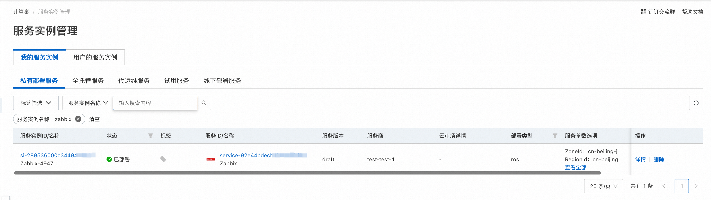
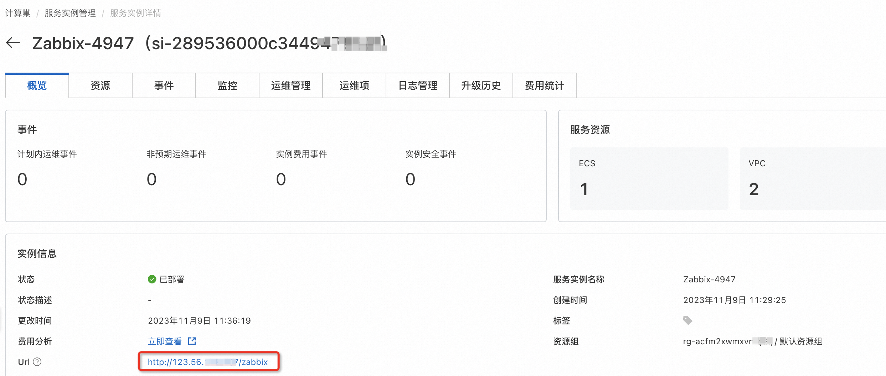
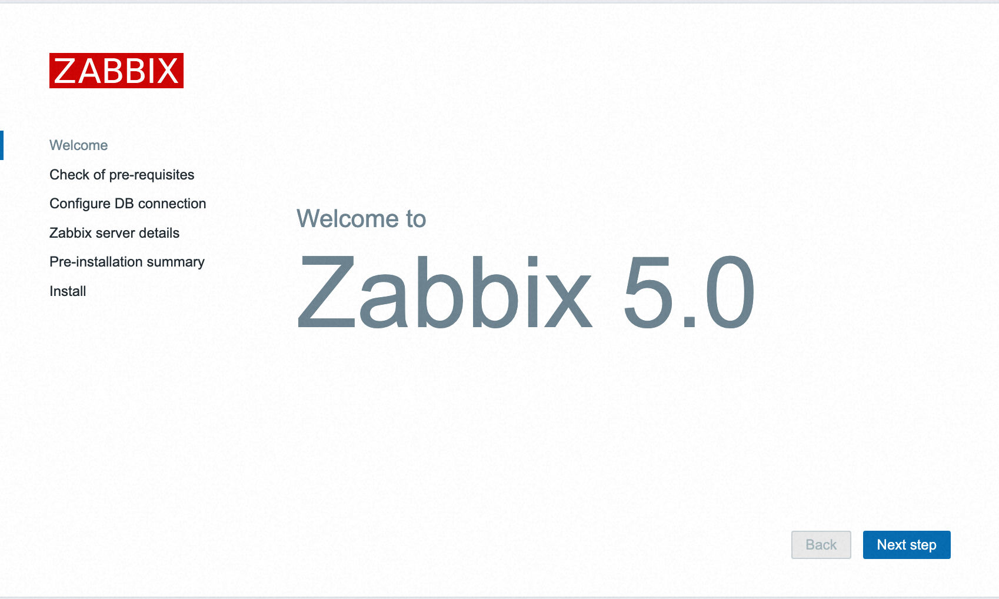
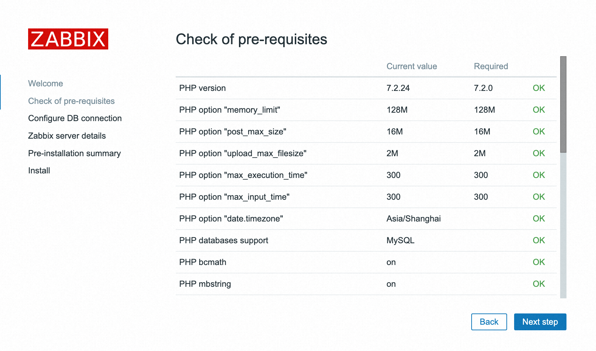
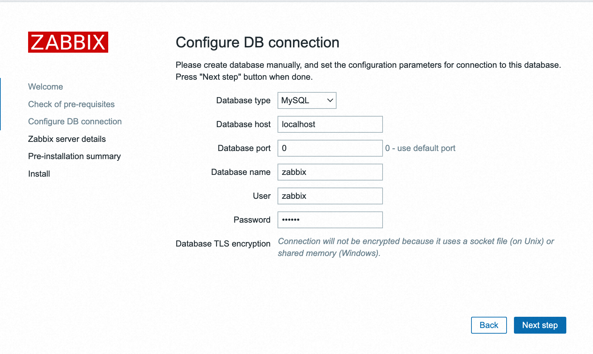
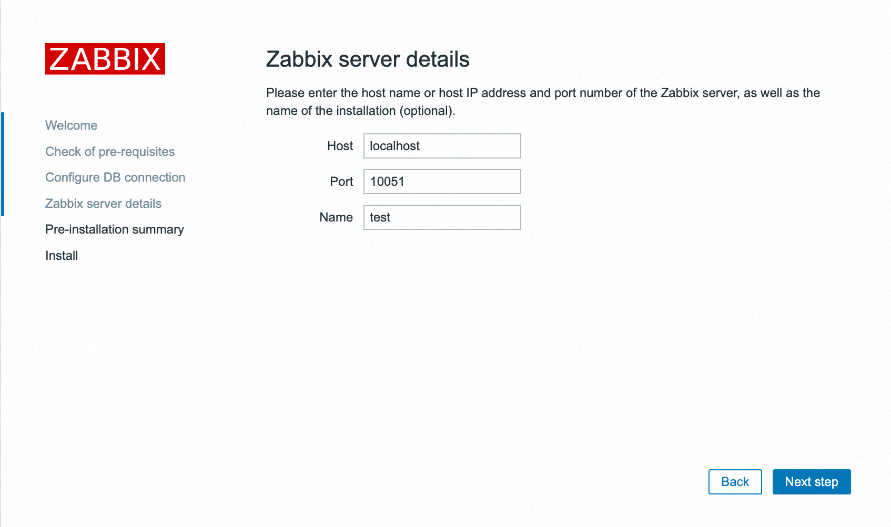
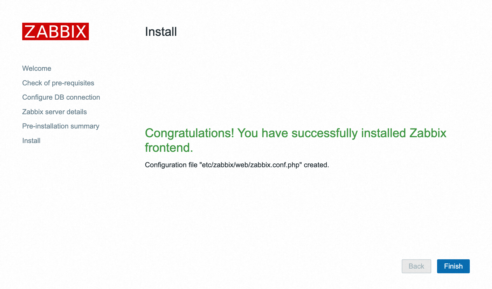
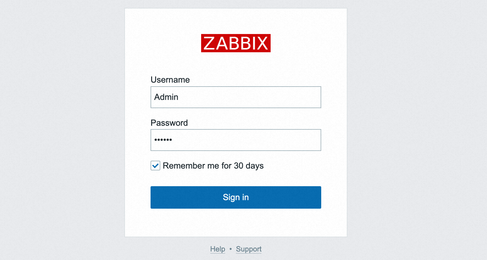

# Zabbix服务实例部署文档

> **免责声明：**
>
> 本服务由第三方提供，我们尽力确保其安全性、准确性和可靠性，但无法保证其完全免于故障、中断、错误或攻击。因此，本公司在此声明：对于本服务的内容、准确性、完整性、可靠性、适用性以及及时性不作任何陈述、保证或承诺，不对您使用本服务所产生的任何直接或间接的损失或损害承担任何责任；对于您通过本服务访问的第三方网站、应用程序、产品和服务，不对其内容、准确性、完整性、可靠性、适用性以及及时性承担任何责任，您应自行承担使用后果产生的风险和责任；对于因您使用本服务而产生的任何损失、损害，包括但不限于直接损失、间接损失、利润损失、商誉损失、数据损失或其他经济损失，不承担任何责任，即使本公司事先已被告知可能存在此类损失或损害的可能性；我们保留不时修改本声明的权利，因此请您在使用本服务前定期检查本声明。如果您对本声明或本服务存在任何问题或疑问，请联系我们。

## 概述
Zabbix是一个基于WEB界面的提供分布式系统监视以及网络监视功能的企业级的开源解决方案，用于监测和跟踪各种IT基础设施组件的性能、可用性和健康状态。它能够监控服务器、网络设备、数据库、应用程序等，并提供实时监测、警报通知、数据分析和可视化等功能。

本文向您介绍如何开通计算巢上的Zabbix，以及部署流程和使用说明。

## 计费说明

Zabbix在计算巢上的费用主要涉及：

- 所选 vCPU 与内存规格
- 系统盘类型及容量
- 公网带宽

## 部署架构

## RAM账号所需权限

Zabbix服务需要对ECS、VPC等资源进行访问和创建操作，若您使用RAM用户创建服务实例，需要在创建服务实例前，对使用的RAM用户的账号添加相应资源的权限。添加RAM权限的详细操作，请参见 [RAM 用户授权](https://help.aliyun.com/document_detail/121945.html)
。所需权限如下表所示。

| 权限策略名称                    | 备注                                      |
| ------------------------------- | ----------------------------------------- |
| AliyunECSFullAccess             | 管理云服务器服务（ECS）的权限             |
| AliyunVPCReadOnlyAccess         | 只读访问专有网络（VPC）的权限             |
| AliyunROSFullAccess             | 管理资源编排服务（ROS）的权限             |
| AliyunComputeNestUserFullAccess | 管理计算巢服务（ComputeNest）的用户侧权限 |

## 部署流程

### 部署步骤

单击[部署链接](https://computenest.console.aliyun.com/service/instance/create/cn-hangzhou?type=user&ServiceId=service-7899150b25e5410fa72f)，进入服务实例部署界面，根据界面提示，填写参数完成部署。

### 部署参数说明

您在创建服务实例的过程中，需要配置服务实例信息。下文介绍Zabbix服务实例输入参数的详细信息。

| 参数组                 | 参数项               | 示例                | 说明                                                                                                                                      |
| ---------------------- | -------------------- |-------------------| ----------------------------------------------------------------------------------------------------------------------------------------- |
| 服务实例名称           |                      | zabbix-test       | 实例的名称                                                                                                                                |
| 地域                   |                      | cn-beijing        | 选中服务实例的地域，建议就近选中，以获取更好的网络延时。                                                                                  |
| 网络配置               | 可用区               | cn-beijing-j      | 地域下的不同可用区域。                                                                                                                    |
| ECS 实例配置           | 实例类型             | ecs.s6-c1m2.small | ECS 实例规格，可以根据实际需求选择。                                                                                                      |

### 验证结果
1. 查看服务实例。服务实例创建成功后，部署时间大约需要5分钟。部署完成后，页面上可以看到对应的服务实例。

2. 通过服务实例访问Zabbix。进入到对应的服务实例后，可以在页面获取到Zabbix页面的地址。

3. 进入到对应的服务实例后，点击ZabbixURL后面的链接，进行Zabbix配置与使用，登陆成功后，点击Next step。

4. 检查基础环境是否正常，确认每一项都是OK的。点击Next step。

5. 配置数据库的链接，输入密码（默认为zabbix）。点击Next step。

6. 若上一步配置正确，则可进入以下界面，输入Name。点击Next step。

7. 显示安装信息。点击Next step后开始安装。

 
8. 安装完成，点击Finish后跳转到登陆界面。

9. 输入默认用户Admin，密码zabbix，以Zabbix超级用户登陆。

10. 登录页面如下所示。

## 帮助文档

请访问[Zabbix用户指南](https://www.zabbix.com/documentation/5.0/zh/manual/quickstart/login)了解如何使用。
